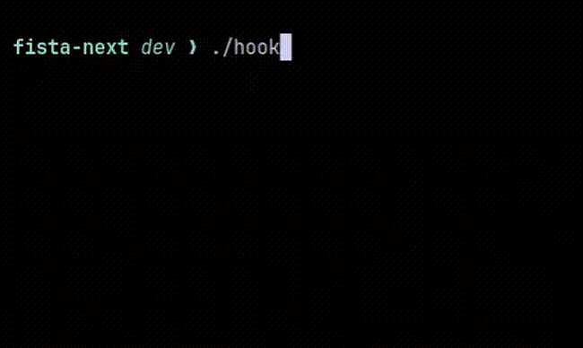

# Husky Parallel Checks

A lightweight Husky hook that runs multiple checks in parallel with a live terminal spinner.

<p align="center">
  
</p>

## Features

* Runs checks in parallel
* Live spinner for running checks
* Individual execution times
* Clear pass/fail output
* Fails the hook if any check fails
* Handles `Ctrl+C` gracefully
* No external dependencies
* Uses POSIX `sh`

## Installation

Copy the hook into your project's Husky directory:

```bash
cp hook .husky/<hook>
chmod +x .husky/<hook>
```

Make sure [Husky](https://typicode.github.io/husky/) is already configured in your project.

## Configuration

Edit the `CHECKS` variable in `hook` to define the checks you want to run:

```sh
CHECKS="
ESLint|pnpm lint
TypeScript|pnpm typecheck
Tests|pnpm test:changed
"
```

Each line follows this format:

```text
Name|command
```

For example:

```sh
CHECKS="
Lint|pnpm lint
Typecheck|pnpm typecheck
Unit Tests|pnpm test
Build|pnpm build
"
```

All checks are started in parallel.

## Output

While checks are running:

```text
Checks
────────────────────────────────────────
⠋ ESLint       checking...
⠋ TypeScript   checking...
⠋ Tests        checking...
```

When completed:

```text
Checks
────────────────────────────────────────
✓ ESLint       passed (4s)
✗ TypeScript   failed (2s)
    └──> Run: pnpm typecheck
✓ Tests        passed (3s)
────────────────────────────────────────
Total: 4s
```

If a check fails, the hook exits with a non-zero status and prevents the push.

## Requirements

* Git
* Husky
* A POSIX-compatible shell
* The commands configured in `CHECKS`

### Platform support

Expected to work on:

* Linux (tested ✅)
* macOS
* Windows with Git for Windows

## License

MIT
